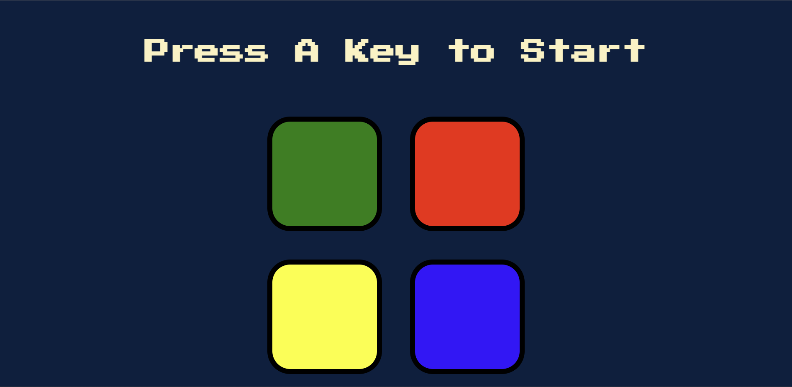

# Simon Game
Simon is an electronic game of short-term memory skill invented by Ralph H. Baer and Howard J. Morrison, working for toy design firm Marvin Glass and Associates, with software programming by Lenny Cope.

The game creates a series of tones and lights and requires a user to repeat the sequence. If the user succeeds, the series becomes progressively longer and more complex. Once the user fails to follow the pattern, the game is over.

### Preview

### Developed with
- HTML
- CSS
- Javascript
